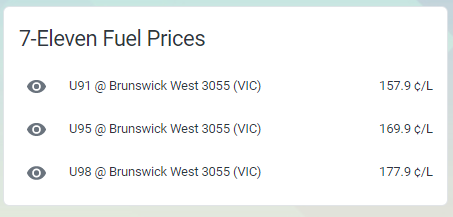

# Project Three Zero (7-11 Fuel Lock) for Home Assistant

A simple component for home assistant to display the cheapest prices around australia for your helicopter journeys :)

<p align="center">
    
    
</p>

## Using the component

1) Install [HACS](https://hacs.xyz/docs/installation/manual) if you haven't already
2) Head over to the `HACS` tab, and click on the "Custom Repositories" menu icon.
3) Enter the URL `https://github.com/atymic/project_three_zero_ha` and `Integration" for the category and hit save.
4) Add it to your `platforms` in your `configuration.yaml`:
    ```yaml
    sensor:
      - platform: project_zero_three
    ```

4) Restart HA
4) Check the entity list, you should see them populated (named `project_three_zero_<fuelcode>`)

## Region Id Definition

<table>
    <tr>
        <th>Region Id</th>
        <th>Region Name</th>
        <th>Description</th>
    </tr>
    <tr>
        <td>0</td>
        <td>All</td>
        <td>Best price across all states</td>
    </tr>
    <tr>
        <td>1</td>
        <td>VIC</td>
        <td>Best price in Victoria</td>
    </tr>
    <tr>
        <td>2</td>
        <td>NSW</td>
        <td>Best price in NSW</td>
    </tr>
    <tr>
        <td>3</td>
        <td>QLD</td>
        <td>Best price in Queensland</td>
    </tr>
    <tr>
        <td>4</td>
        <td>WA</td>
        <td>Best price in Western Australia</td>
    </tr>
    <tr>
        <td>5</td>
        <td>All-2</td>
        <td>2nd best price across all states</td>
    </tr>
    <tr>
        <td>6</td>
        <td>VIC-2</td>
        <td>2nd best price in Victoria</td>
    </tr>
    <tr>
        <td>7</td>
        <td>NSW-2</td>
        <td>2nd best price in NSW</td>
    </tr>
    <tr>
        <td>8</td>
        <td>QLD-2</td>
        <td>2nd best price in Queensland</td>
    </tr>
    <tr>
        <td>9</td>
        <td>WA-2</td>
        <td>2nd best price in Western Australia</td>
    </tr>
    <tr>
        <td>10</td>
        <td>All-3</td>
        <td>3rd best price across all states</td>
    </tr>
    <tr>
        <td>11</td>
        <td>VIC-3</td>
        <td>3rd best price in Victoria</td>
    </tr>
    <tr>
        <td>12</td>
        <td>NSW-3</td>
        <td>3rd best price in NSW</td>
    </tr>
    <tr>
        <td>13</td>
        <td>QLD-3</td>
        <td>3rd best price in Queensland</td>
    </tr>
    <tr>
        <td>14</td>
        <td>WA-3</td>
        <td>3rd best price in Western Australia</td>
    </tr>
    <tr>
        <td>15</td>
        <td>ACT</td>
        <td>Best price in ACT</td>
    </tr>
    <tr>
        <td>16</td>
        <td>ACT-2</td>
        <td>2nd best price in ACT</td>
    </tr>
    <tr>
        <td>17</td>
        <td>ACT-3</td>
        <td>3rd best price in ACT</td>
    </tr>
</table>
